## Git & GitHub : Versiyon Kontrolü
Git : Versiyon Kontrol Sistemidir.

### Windows Git Kurulum
Windows'a Git'i kurmak için [[kaynak]](https://git-scm.com/download/win).       <br/>
Hazır ayarlar kullanılarak `Next` butonuna tıklayıp geçiyoruz. En son `Install` seçeneğine tıklayarak yüklemeyi başlatıp yüklendikten sonra da `Finish` butonuna tıklayarak kapatıyoruz.
```bash
        git --version
```
Yükleme işlemi başarıyla sona erdikten sonra yukarıdaki komutu kullanarak Git versiyonunun kontrol edebiliriz.  <br/>
Komutları yükleme sonrası `Git Bash` komut iştemcisine yazıyoruz.


### Mac ve Linux Kurulumu
Mac ve Linux sistemlerde hali hazırda Git kurulu olur.  <br/>
Eğer sistemde yüklü değilse ve yüklememiz gerekirse [[kaynak]](https://git-scm.com/download).   <br/>
Binary installer'ı kullanarak Git yüklenebilir.
```bash
        git --version
```

Yukarıdaki komutu kullanarak Git'in çalışıp çalışmadığını görebiliriz.
```bash
        git
```
Git yüklüyse yukarıdaki komutu girerek Git Dokümantasyonuna ulaşabiliriz.

###  Git Bash - Terminal Kullanımı 
Windows, Mac ve Linux için Git komutları farklılık göstermez, aynıdır.

- İçerisinde bulunduğumuz dizinde diğer klasörleri ve dokümanları gösterir.
```bash
        ls      
```
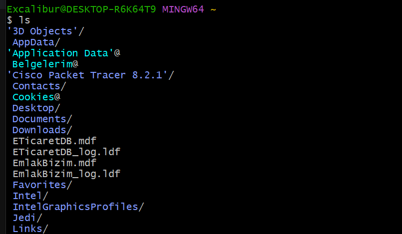

- Klasör içerisindeki gizli dosyaları da görmek istersek:
```bash
        ls -la      
```
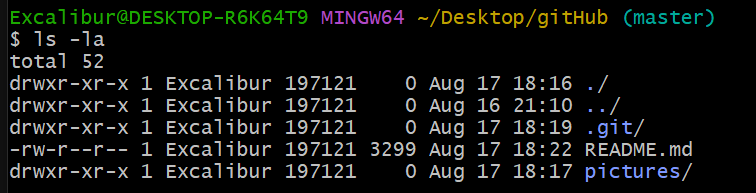

- Üzerinde bulunduğumuz dizini bulmak için:
```bash
        pwd
```
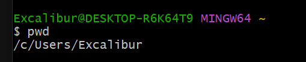

- Dizindeki diğer klasörlere ulaşabilmek için:
```bash
        cd KlasorAdi
```
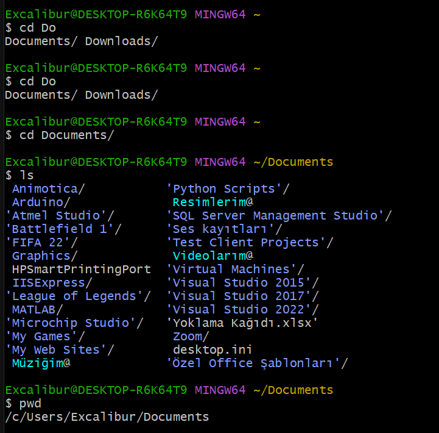

- Bir önceki dizine geri dönebilmek için:
```bash
        cd ..
```
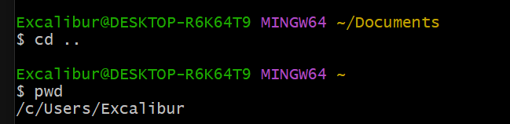

- Terminal çıktılarını temizlemek için:
```bash
        clear
```

- Dizin üzerinde klasör oluşturmak için:
```bash
        mkdir KlasorAdi
```
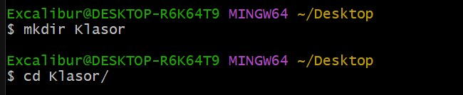

- Dizinde dosya oluşturmak için:
 ```bash
        touch dosya.uzantısı
 ```
 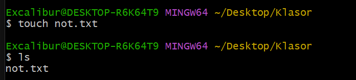

 - Dizinden dosya kaldırmak için:
```bash
        rm dosya.uzantısı
 ```
 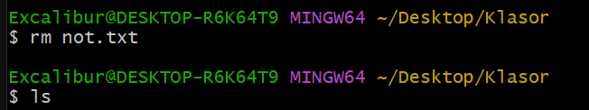

- Dizinden klasör kaldırmak için:
```bash
        rm -rf KlasorAdi
```
 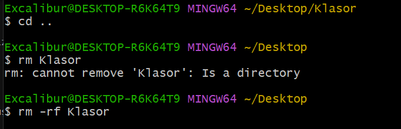

### Kullanıcı Adı ve Email Girmek
- Git sistemine kullanıcı adımızı ve email bilgilerimizi kaydetmek için:
```bash
        git config --global user.name "UserName Surname"

        git config user.name
```
 
 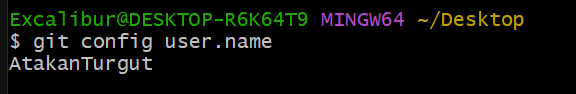

- Git sistemine email bilgisini kaydetmek için:
```bash
        git config --global user.email user@email.com

        git config user.email
```
 

### Git Temel Komutları
```cs
        Çalşıma Klasörü      =>      Index - Staging       =>       Local Repository
                          git add                      git commit
```

- Git güncel durumunu göstermek için:
```bash
        git status
```
Herhangi bir yerde `git init` komutunu çalıştırmadan önce git durumunu kontrol etmek her zaman için doğru olacaktır. <br/>
Aksi halde git'i birkaç farklı aktif etme durumu çakışmalara sebep olabilir.
 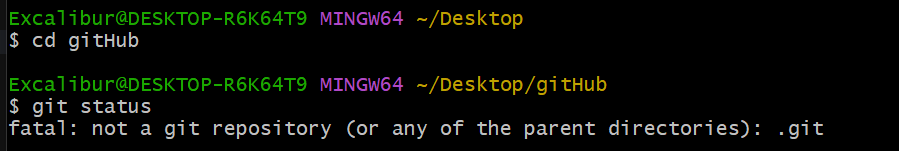

 - Git'i klasörde aktif etmek için:     master veya main branch olarak çalıştırır.
 ```bash
        git init
```
 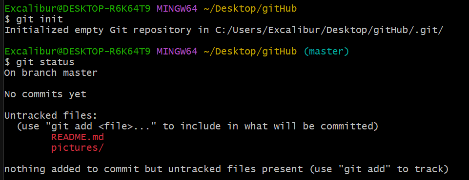

 - Git'e dosya veya klasör eklemek için:
```bash
        git add dosya.uzantısı
```
 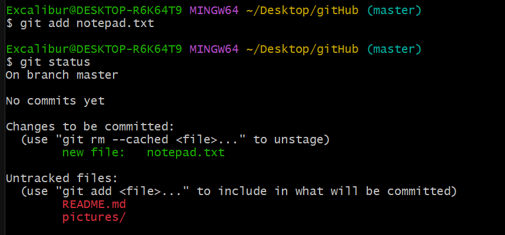

- Git'e yapılanların tümünü eklemek için:
```bash
        git add .
```
 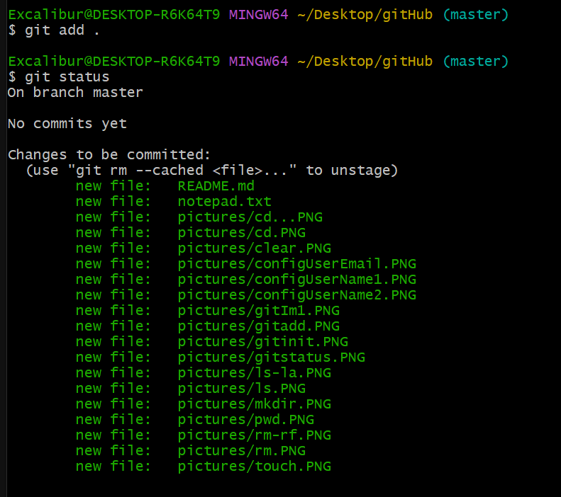

- Git'e eklenenlerin işlenebilmesi için:
```bash
        git commit -m "commit message"
```
- İşleme alma mesajı yapılanları açıklayıcı olmalıdır.
 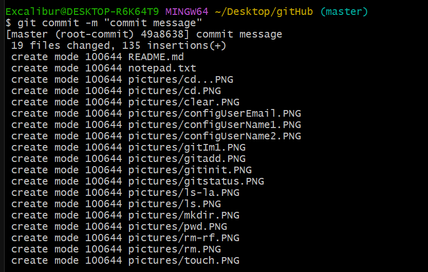

 - İşlemleri görebilmek için:
 ```bash
        git log
```
Her commit'in kendine ait bir işlem numarası olur. <br/>
İşlem numarasına dönmek istersek o amaçla kullanılır.

        HEAD -> master

Üzerinde bulunduğumun branch'ı gösterir


- Yapılan değişiklikleri tekrardan Git'e eklemek ve kontrolleri tekrardan sağlamak için kısaca:
```bash
        git add .
        git commit -m "commit message"
        git status
        git log
```
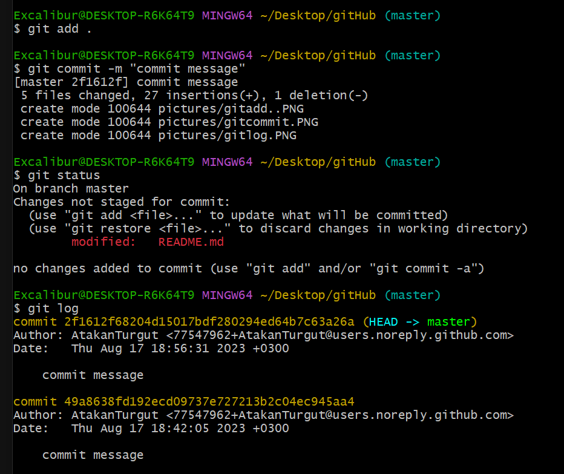

Gizli kalmasını istediğimiz dosyaları `Local Repo`'ya kaydetmek istemeyiz.
- `git add` yapılmaması gerekir.
- Öncelikle `.gitignore` isimli bir dosya oluşturmalıyız.
```bash
        touch .gitignore
```
gitignore dosyası içerisine gizli kalmasını istediğimiz dosyayı uzantısıyla birlikte yazmalıyız.
Gizli kalmasını istediğimiz dosya artık Git sorumluluğuna girmez.
```cs
        gitignore  ==>  dosya.uzantısı
```
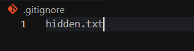


### Branch İşlemleri

        HEAD -> master

MASTER : Genellikle ana branch olarak kullanılır. Bir projenin bitmiş son halini temsil eder.
HEAD -> branch : Bizim git içerisinde hangi konumda (branch) olduğumuzu gösterir. Genellikle son commit'i gösterir.
- Var olan branch'leri görüntülemek için:
```bash
        git branch 
```
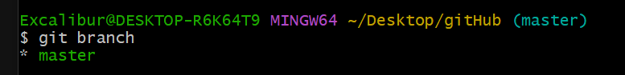

- Başka bir branch oluşturmak için:
```bash
        git branch BranchAdi 
```
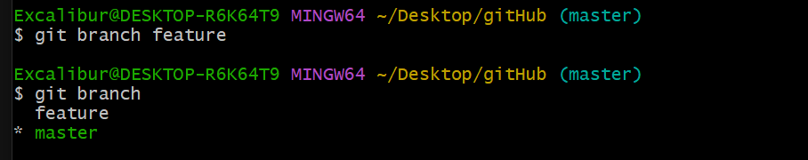

- Başka bir branch'a geçiş yapmak için:
```bash
        git switch BranchAdi 
```
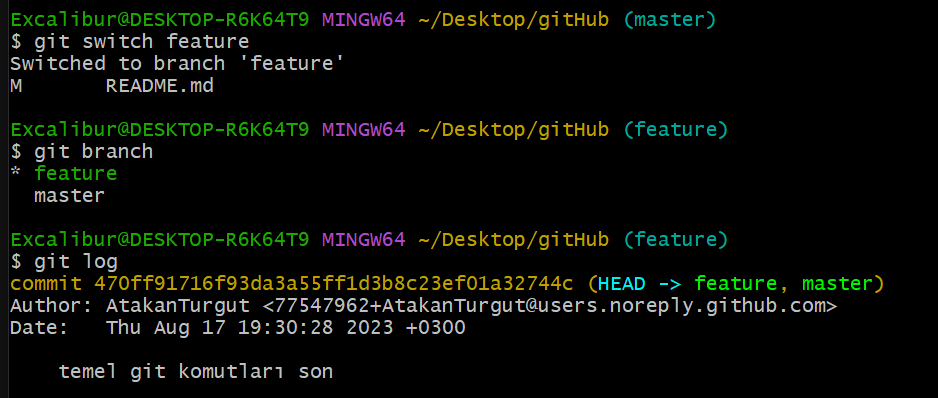

- İki branch'ı birleştirmek için:
Hangi branch'a merge'leyeceksek o branch üzerinde olmalıyız.
```bash
        git branch master
        git merge BirlesirilecekBranch
```
```cs
        master  <--  BirlesirilecekBranch
        master branchine BirlesirilecekBranch eklenmiş olur.
```
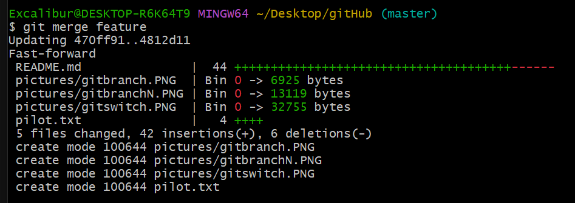

### Fast Forwarding 
 Master branch üzerinde hiçbir değişiklik yapmadan başka bir branch ile ilerleyerek en son Master branch ile birleştirme (merge) işlemidir.

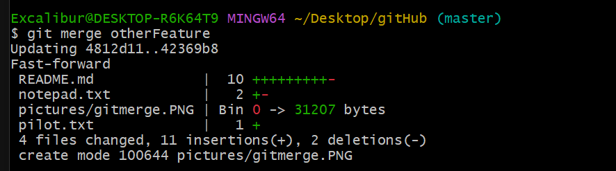

###  Merge Conflict  
Master branc içerisinde commit oluşturarak Merge Conflict işlemini çözebiliriz.
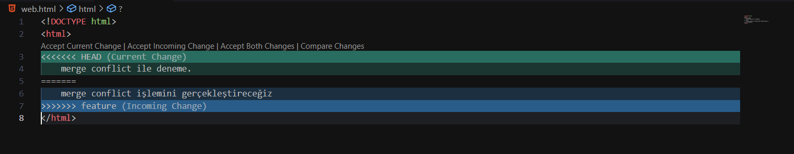
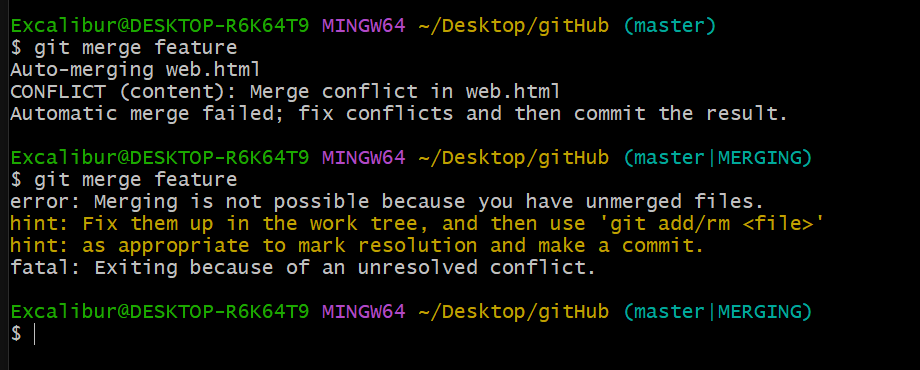
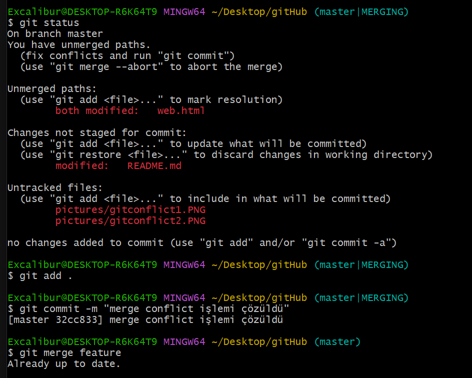
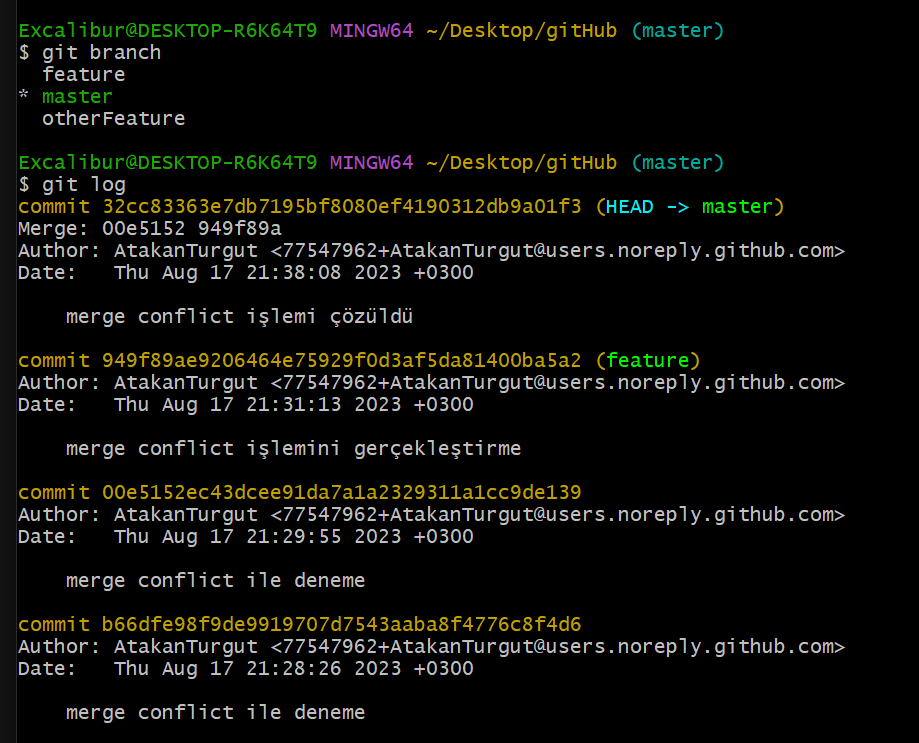

### Stash
Başka bir branch'da oluşturulan bir dosya commit işlemi yapılmadan git'e eklendiyse (git add <>) ve ardından tekrar başka bir branch'e geçildiyse diğer branch'de oluşturulan dosya da geçilen branch'e taşınır.  <br/>
Bu durumu önlemek için kendi branch'imiz üzerindeki değişiklikleri saklayıp tutmamız gerekir. Bunun aşağıdaki kodu kullanırız:
```bash
        git stash 
```
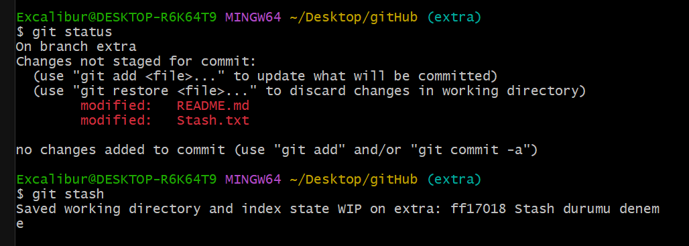

Diğer branch üzerinde işlerimizi hallettikten sonra, kendi branch'imizde sakladığımız komutları aşağıdaki kod yardımıyla gerçekleştiririz.
```bash
        git stash pop
```
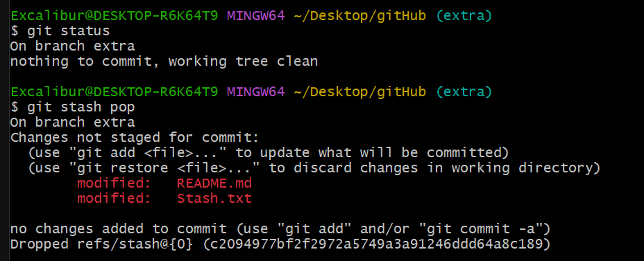

Saklanan verilerin listesini görebilmek için:
```bash
        git stash list
```
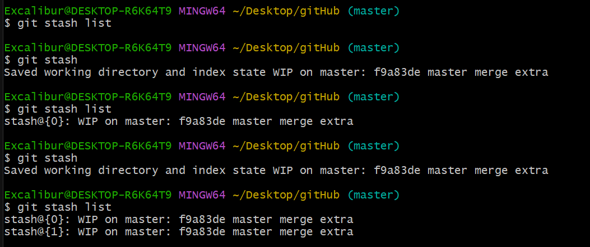

İstediğimiz `Stash'i` işleme almak için:
```bash
        git stash apply stash@{i}
```
Stash'i tekrar uygulamaya alsak da gerektiğinde tekrar kullanabilmek adına yine saklanmaya devam eder.


Var olan saklı Stash'lerin hepsini listeden temizlemek için:
```bash
        git stash clear
```
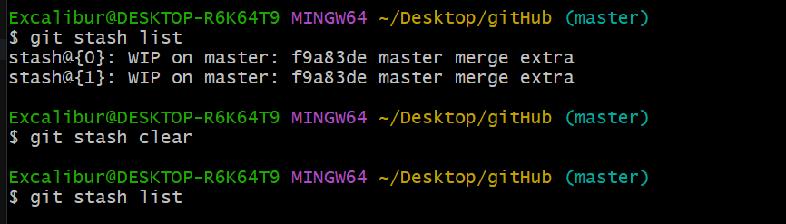

- Çalışma yaptığımız dosya commit attıktan sonra bir şekilde bozulur veya sıkkıntı çıkartırsa ise eski commit'li haline döndürmek için aşağıdaki komutu kullanarak düzeltmemizi yapabiliriz:
```bash
        git restore dosya.uzantıs
```


### Checkout
- Commitlerimiz arasında gezinebilmek için:
```bash
        git checkout commitId
```
Detached HEAD : 
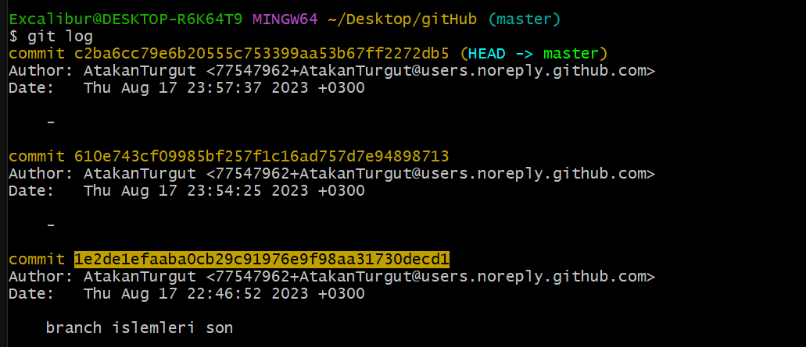
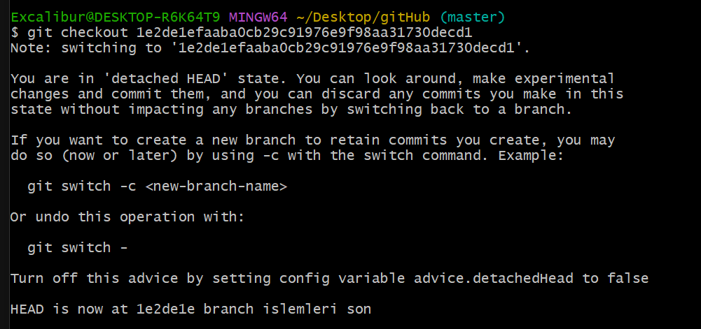
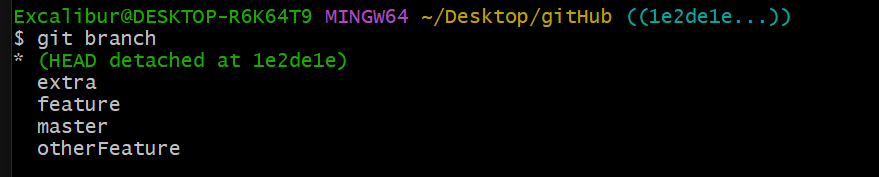
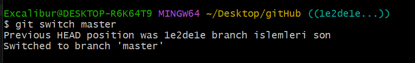

- Yapılacak işlemler yapıldıktan sonra ayrı bir branch oluşturulup devam edilebilir veya alınacak notlar vesayre alındıktan sonra  yapılabilecek en kolay haliyle çalışılan branch'a geri dönülebilir:
```bash
        git switch master
```
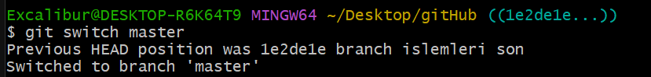

### Reset vs Revert
- Geçmiş bir `commit'e` dönüm ondan önceki bütün komiyleri kaldırmak için:
```bash
        git switch master
```

